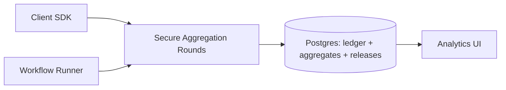

## Overview

This system ships analytics as a small set of **versioned metric templates** (DAU, funnels, retention, histograms, top-K from a fixed vocabulary). Devices compute **bounded contributions** locally, cohorts run **secure aggregation** so the server only learns cohort totals, and a single release path applies **central differential privacy (DP)** and publishes results.

The system stays operable by keeping the query surface tiny and making every release **deterministic, budgeted, and auditable**. Teams request metrics, not data.

## What Makes This Hard

The hard part is **governance under composition**: repeated slicing and retries/backfills can turn “private per query” into leakage. Privacy holds only if releases are strictly limited, deterministically identified, and globally accounted.

The other hard part is **cohort reality**: dropouts, skewed connectivity, and operational misconfiguration. Secure aggregation must fail closed, cohorts must stay large, and cohort construction must be constrained to prevent targeting.

## Requirements

### Functional Requirements
- Standard aggregates only: counts, uniques, rates, histograms, top-K over a bounded dictionary.
- Server never sees per-user plaintext; releases are DP-sanitized aggregates only.
- Enforce contribution bounds and minimum cohort size before release.
- Scheduled runs and backfills without double-releasing or double-spending budget.
- Auditable lineage: metric version + cohort parameters + DP spend + released value.

### Scale Targets
- 5M DAU, 50M MAU.
- ~100 daily metrics; ~20 hourly metrics.
- Each client sends at most 1 bounded report/day (1–5KB).
- Cohorts target 10,000 devices; hard floor 1,000 (otherwise no release).
- Freshness: daily within 2 hours of day close; hourly within 20 minutes.

## Key Design Decisions

- **Federated execution + secure aggregation, then central DP**
  - Secure aggregation keeps the server blind to individual values; central DP gives consistent privacy/utility knobs per metric.

- **Metric templates only**
  - Every metric is a contract: bounded contribution, fixed dimensions, capped slices, fixed cadence.

- **One release path with a Postgres-backed ledger**
  - Releases are idempotent, budgeted, and audited via transactional writes and uniqueness constraints.

- **Cadence normalization**
  - Each metric has one “base window” (hourly *or* daily). Other rollups come from post-processing already released DP outputs (no extra privacy spend).

## Architecture

### Components

- **Client SDK**
  - Why it stays: the only reliable place to enforce per-user contribution bounds before data leaves the device.

- **Workflow Runner**
  - Why it stays: one place to schedule windows, form cohorts, drive secure aggregation rounds, and record outcomes deterministically.

- **Secure Aggregation Rounds**
  - Why it stays: prevents the server from observing individual contributions; only cohort totals exist server-side.

- **Postgres (ledger + aggregates + releases)**
  - Why it stays: transactional idempotency and global accounting; the simplest durable store for policy, spends, and released metrics.

- **Analytics UI**
  - Why it stays: keeps consumers on the DP-only surface and makes uncertainty visible.

## Deep Dive: Privacy Budget + Metric Governance (The Real Hard Part)

**1) Metrics are contracts.**  
Each metric template defines:
- Contribution bounds per user per window.
- Allowed dimensions and capped cardinality.
- Maximum slices per window (hard cap).
- Cadence and retention.
- DP mechanism parameters (ε, δ) and expected error.

**2) Cohorts are constrained and reproducible.**  
Cohort membership is derived from:
- A metric-defined eligibility rule (public, pre-committed), and
- Deterministic sampling using a logged seed per window.
This makes targeting observable and prevents “silent one-person cohorts” even before k-threshold gating.

**3) Releases are deterministic spends in Postgres.**  
A release is keyed by:
`(metric_id, metric_version, window_start, window_end, dimension_values_hash)`  
The workflow writes a single transactional “spend + release” record:
- `UNIQUE(release_id)` enforces idempotency across retries/backfills.
- Budget checks happen inside the same transaction (fail closed).
- Any revision is a new release_id and spends additional budget, showing up in lineage.

**4) Pre-DP intermediates are treated as sensitive.**  
Aggregates are stored only as needed for operational retries, with:
- Short TTL/retention,
- Encryption at rest,
- Strict access controls,
- “No release without a recorded spend” invariant.

## Trade-offs

| Optimized For | Sacrificed |
|--------------|------------|
| Strong privacy guarantees | Ad-hoc analyst flexibility |
| Small, enforceable metric surface | Exploratory “one-off” breakdowns |
| Deterministic, auditable releases | Maximum segmentation |
| Simple operations (Postgres + workflow) | Some utility loss (DP noise + slice caps) |

## Failure Modes

- **Ledger/DB down**
  - What happens: secure aggregation may complete, but releases stop.
  - Recover: resume from idempotent release_ids; no release occurs without a committed spend.

- **Cohorts too small / too many slices**
  - What happens: releases are denied; dashboards show gaps or coarser rollups only.
  - Recover: reduce dimensions/slices or widen windows; thresholds remain fixed.

- **Cohort targeting via misconfiguration**
  - What happens: ineligible cohort definitions are rejected (eligibility + deterministic sampling + k-threshold).
  - Recover: rotate to a known-good signed metric config; audit the logged seeds/eligibility inputs.

- **Secure aggregation dropouts**
  - What happens: window fails closed (no aggregate, no release).
  - Recover: over-recruit, extend window, tune dropout tolerance; retry stays idempotent.

- **Bad config deploy increases release surface**
  - What happens: policy invariants reject unsafe configs at runtime.
  - Recover: roll back to prior signed config version; releases remain blocked until invariants pass.

## What We Removed

- Separate **Privacy Ledger service**: replaced by Postgres tables with transactional spend + `UNIQUE(release_id)` idempotency and an append-only audit trail.
- Separate **Metric Scheduler** and **Federated Executor**: merged into one workflow runner that schedules windows, forms cohorts, runs secure aggregation, and records outcomes.
- General-purpose **Aggregate Store**: collapsed into Postgres with TTL retention for intermediates and a single source of truth for released metrics.
- Bespoke DP and secure aggregation implementations: treated as library choices behind the same release path and metric contracts.

## Operational Notes

- The kill switch is the release transaction: if policy invariants or budget checks fail, nothing is published.
- Backfills and retries reuse the same deterministic release_id; revisions mint a new release_id and spend again.
- Monitor: cohort size, dropout rate, denial rate, and expected DP error; alert on sustained “released but useless” error.
