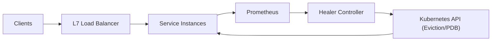

## Overview

This is a control loop that recycles degrading instances (zombie accumulation, runaway memory growth) without dropping traffic. Recycling stays safe by treating it as traffic control: explicit draining, hard disruption budgets, and hysteresis.

The only custom logic is a small controller that decides *when* a recycle is allowed and then performs an idempotent sequence: **in-service → draining → evicted**.

## What Makes This Hard

“Unhealthy” is not “kill now”. If you terminate while traffic still arrives, you sever long-lived connections, trigger retries, and create self-inflicted load spikes.

The real enemy is flapping: noisy signals trigger restarts, restarts cause warmup latency and cache misses, and the system restarts itself into an incident. The design needs trend-based signals, freshness checks, and strict disruption limits.

## Requirements

### Functional Requirements
- Detect and remediate:
  - Zombie process accumulation (sustained increase in zombie count)
  - Memory leaks (monotonic RSS/heap growth under steady load)
- Recycle without dropping traffic:
  - Stop *new* requests before termination
  - Allow in-flight requests to complete up to a bounded drain timeout
- Prevent self-harm:
  - Enforced disruption budget per service
  - Cooldowns/hysteresis to avoid flapping
  - Safe-mode when signals are stale or the control plane is impaired
- Provide auditability:
  - Every recycle decision is explainable from recorded signals and policy

### Scale Targets
- Fleet: 5,000 instances across 50 services
- Detection latency: 15–30s
- Remediation rate limit: max 1% of a service per 10 minutes
- SLO constraint: recycling must not increase 5xx beyond 0.01% during steady state

## What We Removed

- Custom “Node/Pod Agent” daemon; signals come from standard exporters plus one minimal zombie metric
- Direct “delete pod / terminate VM”; recycling uses Kubernetes `Eviction` so PDB enforcement is guaranteed
- Load balancer-specific “confirm endpoint removal”; readiness + EndpointSlice membership is the single canonical check
- Prometheus as the decision state store; Prometheus stays a signal source, while in-progress action state is persisted in Kubernetes (annotations + a per-service `Lease`)

## Minimal Architecture

### Components

- **Service Instances**: Units we recycle. **Why:** only they can guarantee drain correctness (stop accepting new work while finishing in-flight work).
- **L7 Load Balancer**: Routes traffic and respects readiness/draining semantics. **Why:** the reliable way to stop *new* traffic without severing in-flight requests.
- **Prometheus**: Signal source for trends and freshness gating. **Why:** simplest way to compute “slope + persistence” from existing time-series.
- **Healer Controller**: Policy + state machine. **Why:** the minimal custom component that turns signals into safe, rate-limited, idempotent action.
- **Kubernetes API**: Replacement, budgets, and persistence for in-flight action state. **Why:** avoids custom provisioning and uses native PDB enforcement via `Eviction`.

## Deep Dive: Safe Recycling Without Dropping Traffic

Recycling is a small transaction with invariants:

1. **Permission**
   - Require fresh signals (scrape age within 2 intervals); otherwise safe-mode (no new actions).
   - Require service health not already degraded (don’t add churn during incidents).
   - Require disruption budget available (PDB + controller rate limit).

2. **Drain**
   - Mark the instance NotReady.
   - Wait until it is absent from EndpointSlice membership.
   - Require the instance to enter a drain behavior for *new* requests (fast-fail/redirect) while allowing in-flight work to complete.

3. **Bounded grace**
   - Allow in-flight requests/jobs to finish until a hard drain timeout (e.g., 60–120s).
   - Past the deadline, proceed to eviction.

4. **Recycle**
   - Use `Eviction` to remove the pod so PDBs are enforced by the API server.
   - Kubernetes reconciliation replaces capacity.

5. **Cooldown**
   - Apply per-service cooldown and rate limiting (token bucket targeting 1% per 10 minutes).
   - Persist “intent/in-progress” in Kubernetes (annotations + `Lease`) so controller restarts or partial API failures resume cleanly.

### Detection that’s actually actionable

- **Zombie accumulation**
  - Trigger on sustained growth with a small floor:
    - `zombie_slope = deriv(zombie_count[10m])`
    - Act when `zombie_slope > 0` for 10m and `zombie_count` exceeds a small baseline
  - Zombie count comes from existing exporters where available; otherwise a tiny node textfile metric that reports zombies from `/proc`.

- **Memory leak**
  - Use trend plus workload stability gating:
    - `rss_slope = deriv(container_memory_rss[30m])`
    - Gate on stable request rate to avoid confusing load spikes for leaks
  - Act before OOM to avoid latency and retry storms.

Each action records the reason (signal names, windows, threshold results) into Kubernetes (event + persisted action state) so it’s explainable later alongside the Prometheus history.

## Trade-offs

| Optimized For | Sacrificed |
|--------------|------------|
| Zero-drop recycling via draining | Faster “kill it now” remediation |
| Bounded disruption with budgets | Maximum remediation throughput |
| High-confidence, trend-based triggers | Catching extremely rare edge cases instantly |
| Native primitives (readiness, EndpointSlice, PDB, eviction) | Provider-specific “perfect” LB propagation guarantees |

## Failure Modes

- **Prometheus down / signals stale**
  - *What happens:* Trend-based decisions become unsafe.
  - *Recover:* Safe-mode (no new recycling); rely on local Kubernetes protections (liveness/OOMKill) until signals return.

- **Kubernetes API partially failing / slow**
  - *What happens:* Drain/evict steps stall or partially apply.
  - *Recover:* State machine resumes from persisted action state; deadlines force progress or cancel; no duplicate drains for the same instance.

- **Draining but traffic still arrives**
  - *What happens:* Some clients/LBs continue sending traffic briefly.
  - *Recover:* Instance drain behavior rejects *new* requests once draining starts; in-flight work completes until timeout.

- **Bad policy/config deploy (over-aggressive)**
  - *What happens:* Recycle rate spikes and causes churn.
  - *Recover:* Controller kill-switch + dry-run mode; hard global ceiling on recycle rate independent of thresholds.

- **Network partition / controller duplication**
  - *What happens:* Multiple controllers attempt the same action or actions stop mid-flight.
  - *Recover:* Leader election + persisted “intent/in-progress” in Kubernetes makes actions idempotent; partitions stop progressing rather than duplicating.

## Operational Notes

- Enforce a simple “drain contract” for services: NotReady must cut off new traffic fast, and shutdown must finish within the drain timeout.
- Budgets are two knobs: **PDB** for concurrency and **token bucket** for rate; both are always-on.
- Alert on leading indicators: recycle rate, time-in-drain, and “healing blind” (stale signals).
- Every action emits a Kubernetes event and persists minimal action state (who/why/when/deadline) so failures and restarts are routine, not special.
